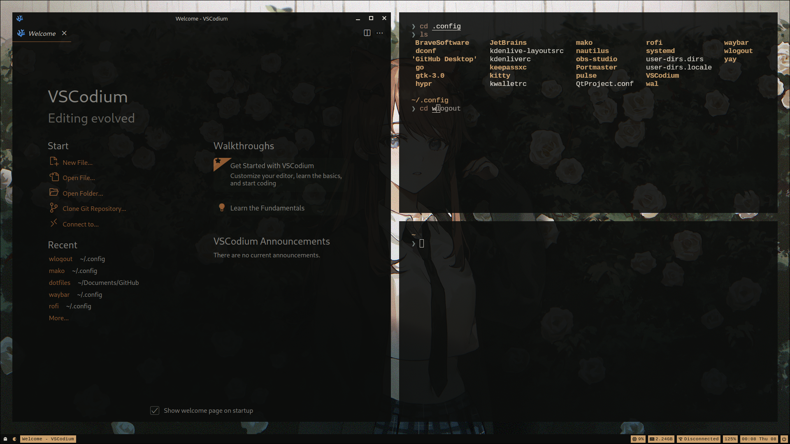

# **PYWAL DOTS**

## **Install Needed Packages**

`sudo pacman -S nano timeshift git zsh kitty nautilus ufw gnome-font-viewer ly hyprland rofi mako python-pywal`

## **Enable Login Manager**

`sudo systemctl enable ly.service`

## **Install yay**

`sudo pacman -S --needed git base-devel && git clone https://aur.archlinux.org/yay.git && cd yay && makepkg -si`

## **Install Hyprland stuff**

`yay -S hyprpaper hypridle hyprlock waybar hyprshot wlogout`

## **Switch To zsh**

`chsh -s $(which zsh)`

## **Install oh-my-zsh and p10k + zsh plugins**

`sh -c "$(curl -fsSL https://raw.githubusercontent.com/ohmyzsh/ohmyzsh/master/tools/install.sh)"`

`git clone --depth=1 https://github.com/romkatv/powerlevel10k.git ~/powerlevel10k`

`echo 'source ~/powerlevel10k/powerlevel10k.zsh-theme' >>~/.zshrc`

`git clone https://github.com/zsh-users/zsh-syntax-highlighting.git ${ZSH_CUSTOM:-~/.oh-my-zsh/custom}/plugins/zsh-syntax-highlighting`

`git clone https://github.com/zsh-users/zsh-autosuggestions ${ZSH_CUSTOM:-~/.oh-my-zsh/custom}/plugins/zsh-autosuggestions`

## **Install Nvidia Drivers**

`sudo pacman -S nvidia nvidia-utils nvidia-settings`

## **GTK Theme**

`yay -S dracula-gtk-theme`

## **Install Apps**

| Type                                           |
| ---------------------------------------------- |
| yay -S librewolf-bin                           |
| yay -S vscodium-bin                            |
| yay -S brave-bin                               |
| sudo pacman -S intellij-idea-community-edition |
| sudo pacman -S keepassxc                       |
| sudo pacman -S obsidian                        |
| yay -S portmaster-stub-bin                     |
| yay -S github-desktop-bin                      |
| sudo pacman -S obs-studio                      |
| sudo pacman -S kdenlive                        |

## **Setup Font**

Install [Cousine Nerd Font](https://www.nerdfonts.com/font-downloads)

## **Rice**

copy .dotfiles

## **For Screen Recording**

`yay -S xdg-desktop-portal-hyprland-git`

## **Setup ufw**

`sudo ufw limit 22/tcp`

`sudo ufw allow 80/tcp`

`sudo ufw limit 443/tcp`

`sudo ufw default deny incoming`

`sudo ufw default allow outgoing`

`sudo systemctl enable ufw.service`

## **TODO**

- improve dots layout
- improve rofi | waybar | wlogout
- fastfetch
