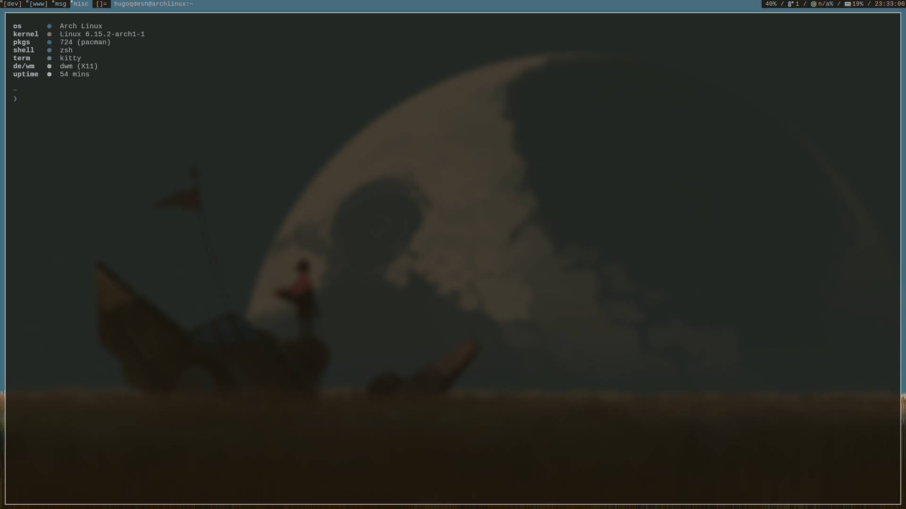

<div align="center">

# **DWM PYWAL DOTS**

This is my daily driver configuration that I use for everything like coding, browsing the web, etc. I am constantly trying to add new improvements.

I use Arch BTW.. :)



</div>

### Install basic packages

```bash
sudo pacman -S base-devel git nano kitty picom zsh nautilus ufw flameshot feh fastfetch
```

### Clone dwm

```bash
git clone https://git.suckless.org/dwm
```

```bash
git clone https://git.suckless.org/dmenu
```

```bash
git clone https://git.suckless.org/st
```

```bash
git clone https://git.suckless.org/slstatus
```

### Install needed packages

```bash
sudo pacman -S xorg-server xorg-xinit libx11 libxinerama libxft webkit2gtk
```

### .xinitrc

```bash
nano .xinitrc #add "exec dwm" there
```

### clean install

```bash
run sudo make clean install in all dwm folders
```

### config.h

```bash
replace /bin/sh to /usr/local/bin/st
```

### .bash_profile

```bash
nano .bash_profile # add "startx" to the bottom
```

### Install yay

```bash
sudo pacman -S --needed git base-devel && git clone https://aur.archlinux.org/yay.git && cd yay && makepkg -si
```

### Switch to zsh

```bash
chsh -s $(which zsh)
```

### Install oh-my-zsh, p10k and zsh plugins

[oh-my-zsh](https://ohmyz.sh/)

[powerlevel10k](https://github.com/romkatv/powerlevel10k)

[zsh-syntax-highlighting](https://github.com/zsh-users/zsh-syntax-highlighting)

[zsh-autosuggestions](https://github.com/zsh-users/zsh-autosuggestions)

### Install nvidia drivers

```bash
sudo pacman -S nvidia nvidia-utils nvidia-settings
```

### Pywal

```bash
yay -S python-pywal16
```

### Install apps

|                             |
| --------------------------- |
| `sudo pacman -S keepassxc`  |
| `sudo pacman -S obsidian`   |
| `sudo pacman -S obs-studio` |
| `sudo pacman -S kdenlive`   |
| `yay -S librewolf-bin`      |
| `yay -S vscodium-bin`       |
| `yay -S jetbrains-toolbox`  |
| `yay -S vesktop-bin`        |
| `sudo pacman -S steam`      |

### Install needed font

Install [Cousine Nerd Font](https://www.nerdfonts.com/font-downloads)

### Start ricing

copy .dotfiles

### Setup ufw

```bash
sudo ufw limit 22/tcp
```

```bash
sudo ufw allow 80/tcp
```

```bash
sudo ufw limit 443/tcp
```

```bash
sudo ufw default deny incoming
```

```bash
sudo ufw default allow outgoing
```

```bash
sudo systemctl enable ufw.service
```

### Patches

[alwayscenter](https://dwm.suckless.org/patches/alwayscenter/)

[attachbottom](https://dwm.suckless.org/patches/attachbottom/)

[restartsig](https://dwm.suckless.org/patches/restartsig/)

[tiledmove](https://dwm.suckless.org/patches/tiledmove/)

[vanitygaps](https://dwm.suckless.org/patches/vanitygaps/)

[pertag](https://dwm.suckless.org/patches/pertag/)

### Screenshots

### Extensions

- librewolf (Chameleon, Decentraleyes, uBlock Origin)

- vscodium (Auto Rename Tag, Code Spell Checker, Error Lens, ES7+ React/Redux, Path Intellisense, Prettier, Pretty TypeScript Errors, Symbols, Tailwind CSS IntelliSense, Wal Theme)

- intellij (Rainbow Brackets, Inspection Lens, Garry Themes, Atom Material Icons)

### To-Do

- reformat everything
- neovim
