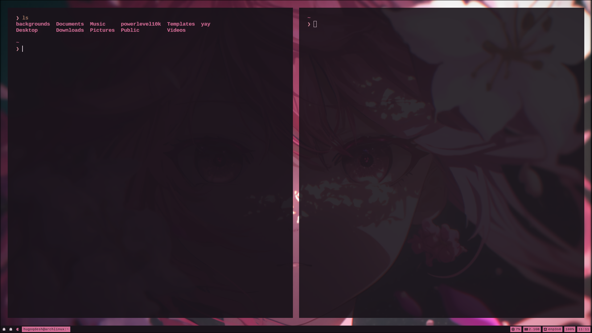
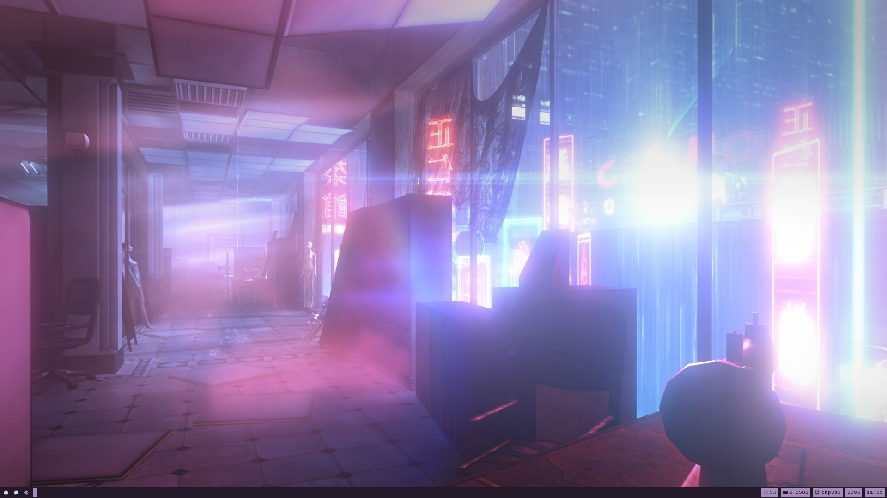
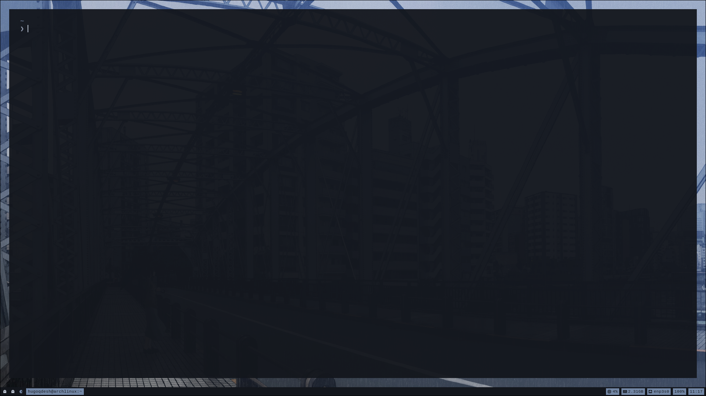

<div align="center">

# **PYWAL DOTS**

This is my daily driver configuration that I use for everything like coding, browsing the web, etc. I am constantly trying to add new improvements.

I use Arch BTW.. :)

</div>

### Install needed packages

```bash
sudo pacman -S nano timeshift git zsh kitty nautilus ufw gnome-font-viewer ly hyprland mako python-pywal
```

### Enable login manager

```bash
sudo systemctl enable ly.service
```

### Install yay

```bash
sudo pacman -S --needed git base-devel && git clone https://aur.archlinux.org/yay.git && cd yay && makepkg -si
```

### Install hyprland packages

```bash
yay -S hyprpaper hypridle hyprlock waybar hyprshot tofi
```

### Switch to zsh

```bash
chsh -s $(which zsh)
```

### Install oh-my-zsh, p10k and zsh plugins

[oh-my-zsh](https://ohmyz.sh/)

[powerlevel10k](https://github.com/romkatv/powerlevel10k)

[zsh-syntax-highlighting](https://github.com/zsh-users/zsh-syntax-highlighting)

[zsh-autosuggestions](https://github.com/zsh-users/zsh-autosuggestions)

### Install nvidia drivers

```bash
sudo pacman -S nvidia nvidia-utils nvidia-settings
```

### GTK theme

```bash
yay -S dracula-gtk-theme
```

### Install apps

|                                                  |
| ------------------------------------------------ |
| `yay -S librewolf-bin`                           |
| `yay -S vscodium-bin`                            |
| `yay -S brave-bin`                               |
| `sudo pacman -S intellij-idea-community-edition` |
| `sudo pacman -S keepassxc`                       |
| `sudo pacman -S obsidian`                        |
| `yay -S portmaster-stub-bin`                     |
| `yay -S github-desktop-bin`                      |
| `sudo pacman -S obs-studio`                      |
| `sudo pacman -S kdenlive`                        |

### Install needed font

Install [Cousine Nerd Font](https://www.nerdfonts.com/font-downloads)

### Start ricing

copy .dotfiles

### Screen sharing package

```bash
yay -S xdg-desktop-portal-hyprland-git
```

### Setup ufw

```bash
sudo ufw limit 22/tcp
```

```bash
sudo ufw allow 80/tcp
```

```bash
sudo ufw limit 443/tcp
```

```bash
sudo ufw default deny incoming
```

```bash
sudo ufw default allow outgoing
```

```bash
sudo systemctl enable ufw.service
```

### Screenshots

|                                |                                |
| :----------------------------: | :----------------------------: |
|  |  |
|  |  |
|  |  |

### To-Do
