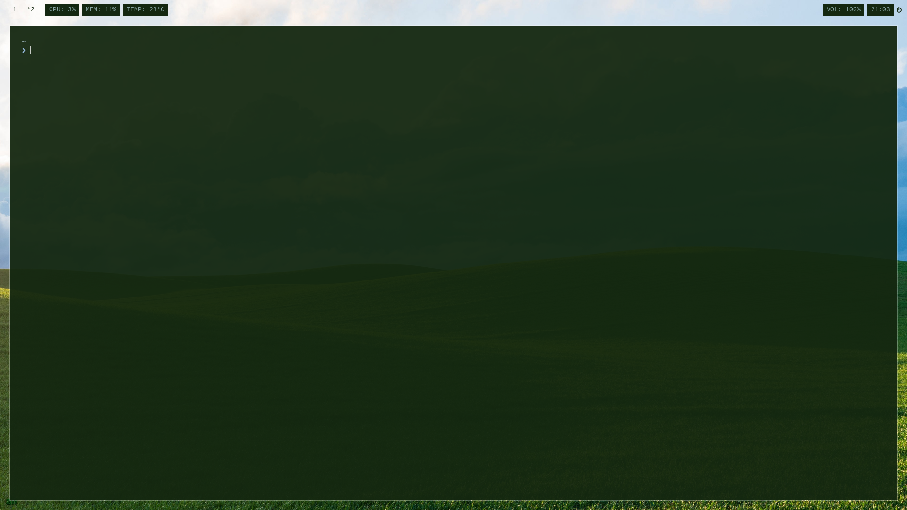

<div align="center">

# **DOTS**

This is my daily driver configuration that I use for everything like coding, browsing the web, etc.

I use Arch BTW.. :)



</div>

### Install packages

```bash
sudo pacman -S base-devel git neovim hyprland hyprpaper hyprpicker hypridle hyprlock hyprsunset kitty wlclipboard picom zsh nautilus ufw bottom bluetui mako waybar hyprshot ttf-cousine-nerd ly zathura zathura-pdf-poppler xdg-desktop-portal-hyprland
```

### Install yay

```bash
sudo pacman -S --needed git base-devel && git clone https://aur.archlinux.org/yay.git && cd yay && makepkg -si
```

### Switch to zsh

```bash
chsh -s $(which zsh)
```

### Install oh-my-zsh, p10k and zsh plugins

[oh-my-zsh](https://ohmyz.sh/)

[powerlevel10k](https://github.com/romkatv/powerlevel10k)

[zsh-syntax-highlighting](https://github.com/zsh-users/zsh-syntax-highlighting)

[zsh-autosuggestions](https://github.com/zsh-users/zsh-autosuggestions)

### Install nvidia drivers

```bash
sudo pacman -S nvidia nvidia-utils nvidia-settings
```

### Pywal

```bash
yay -S python-pywal16
```

### Install apps

|                             |
| --------------------------- |
| `sudo pacman -S keepassxc`  |
| `sudo pacman -S obsidian`   |
| `sudo pacman -S obs-studio` |
| `sudo pacman -S kdenlive`   |
| `yay -S librewolf-bin`      |
| `yay -S brave-bin`          |
| `yay -S vscodium-bin`       |
| `yay -S jetbrains-toolbox`  |
| `yay -S vesktop-bin`        |
| `yay -S tofi`               |

### Install needed font

Install [Cousine Nerd Font](https://www.nerdfonts.com/font-downloads)

### Start ricing

copy .dotfiles

### Setup ufw

```bash
sudo ufw limit 22/tcp
```

```bash
sudo ufw allow 80/tcp
```

```bash
sudo ufw limit 443/tcp
```

```bash
sudo ufw default deny incoming
```

```bash
sudo ufw default allow outgoing
```

```bash
sudo systemctl enable ufw.service
```

### Extensions

- librewolf (Chameleon, Decentraleyes, uBlock Origin, Vimium C, Wappalyzer)

- brave (uBlock Origin, Vimium C)

- vscodium (Auto Rename Tag, Code Spell Checker, Error Lens, ES7+ React/Redux, Path Intellisense, Prettier, Pretty TypeScript Errors, Symbols, Tailwind CSS IntelliSense, Prisma, Wal Theme, Postman)

- intellij (Rainbow Brackets, Inspection Lens, Gerry Themes, Atom Material Icons, Key Promoter X, IdeaVim)
